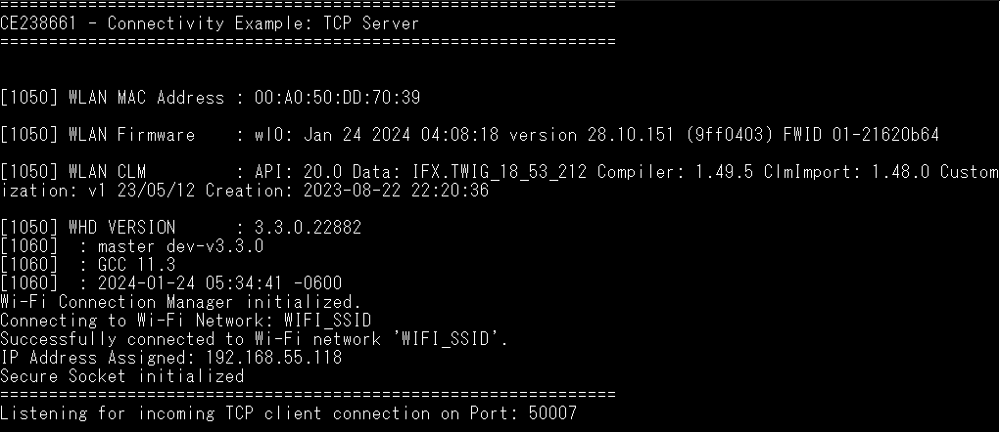
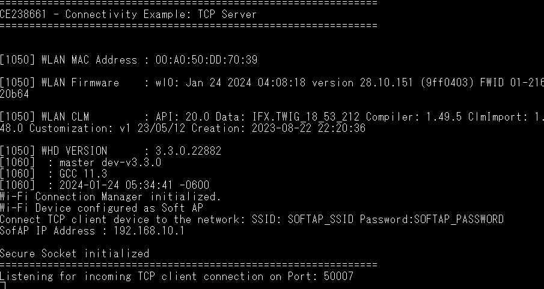
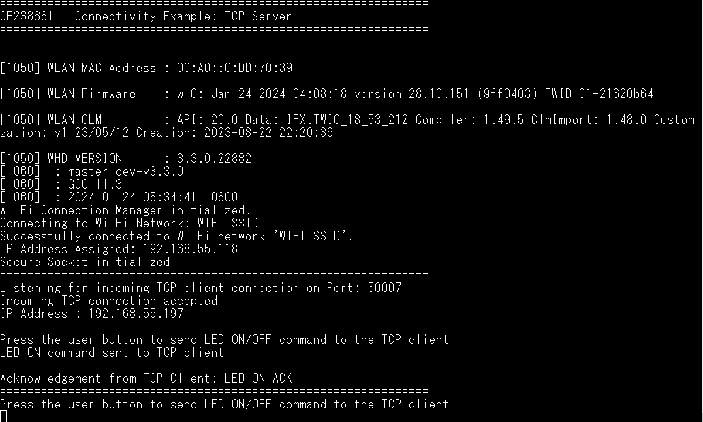
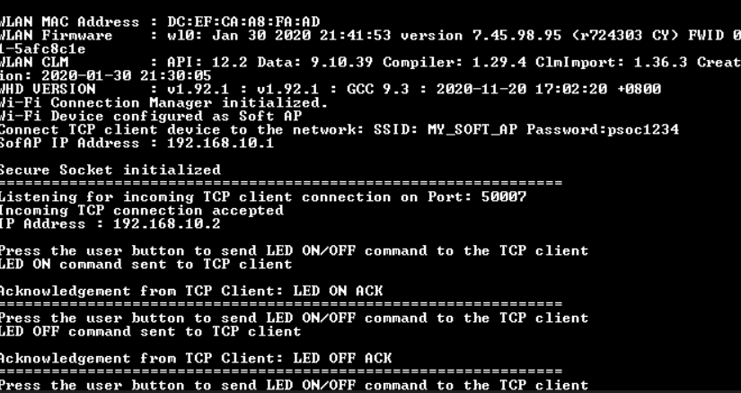
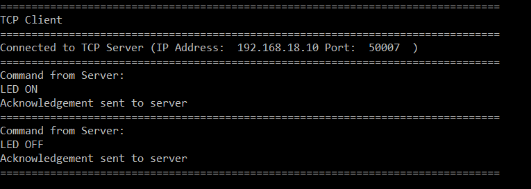

# TCP server

This code example demonstrates the implementation of a TCP server with CYW955913EVK-01. In this example, the TCP server establishes a connection with a TCP client. After the successful connection, the server allows the user to send LED ON/OFF command to the TCP client and the client responds by sending an acknowledgement message to the server. Additionally, this code example can be configured to bring up the Wi-Fi device either in STA interface or Soft AP interface mode.

[View this README on GitHub.](https://github.com/Infineon/mtb-example-threadx-wifi-tcp-server)

[Provide feedback on this code example.](https://cypress.co1.qualtrics.com/jfe/form/SV_1NTns53sK2yiljn?Q_EED=eyJVbmlxdWUgRG9jIElkIjoiQ0UyMzg2NjEiLCJTcGVjIE51bWJlciI6IjAwMi0zODY2MSIsIkRvYyBUaXRsZSI6IlRDUCBzZXJ2ZXIiLCJyaWQiOiJ2ZWxtdXJ1Z2FuIiwiRG9jIHZlcnNpb24iOiIxLjEuMCIsIkRvYyBMYW5ndWFnZSI6IkVuZ2xpc2giLCJEb2MgRGl2aXNpb24iOiJNQ0QiLCJEb2MgQlUiOiJJQ1ciLCJEb2MgRmFtaWx5IjoiV0lGSSJ9)


## Requirements

- [ModusToolbox&trade; software](https://www.infineon.com/modustoolbox) v3.2 or later (tested with v3.2) with ModusToolbox&trade;.
- Board support package (BSP) minimum required version for : v1.0.0.
- Programming language: C
- Associated parts: CYW955913EVK-01 

## Supported toolchains (make variable 'TOOLCHAIN')

- GNU Arm&reg; embedded compiler v11.3.1 (`GCC_ARM`) - Default value of `TOOLCHAIN`


## Supported kits (make variable 'TARGET')
- [CYW955913EVK-01 Wi-Fi Bluetooth&reg; Prototyping Kit](https://www.infineon.com/CYW955913EVK-01) (`CYW955913EVK-01`)


## Hardware setup

This example uses the kit’s default configuration. See the respective kit guide to ensure that the kit is configured correctly.

**Note:** The CYW955513EVK-01 Wi-Fi Bluetooth&reg; prototyping kit ships with KitProg3 version 2.30 installed. The ModusToolbox&trade; software requires KitProg3 with latest version 2.50. Before using this code example, make sure that the board is upgraded to KitProg3 2.50. The tool and instructions are available in the [Firmware Loader](https://github.com/Infineon/Firmware-loader) GitHub repository. If you do not upgrade, you will see an error such as "unable to find CMSIS-DAP device" or "KitProg firmware is out of date".

## Software setup

1. Install a terminal emulator if you don't have one. Instructions in this document use [Tera Term](https://teratermproject.github.io/index-en.html).

2. Install a Python interpreter if you don't have one. This code example is tested using [Python 3.8.10](https://www.python.org/downloads/release/python-3810/).


## Using the code example

### Create the project

The ModusToolbox&trade; tools package provides the Project Creator as both a GUI tool and a command line tool.

<details><summary><b>Use Project Creator GUI</b></summary>

1. Open the Project Creator GUI tool.

   There are several ways to do this, including launching it from the dashboard or from inside the Eclipse IDE. For more details, see the [Project Creator user guide](https://www.infineon.com/ModusToolboxProjectCreator) (locally available at *{ModusToolbox&trade; install directory}/tools_{version}/project-creator/docs/project-creator.pdf*).

2. On the **Choose Board Support Package (BSP)** page, select a kit supported by this code example. See [Supported kits](#supported-kits-make-variable-target).

   > **Note:** To use this code example for a kit not listed here, you may need to update the source files. If the kit does not have the required resources, the application may not work.

3. On the **Select Application** page:

   a. Select the **Applications(s) Root Path** and the **Target IDE**.

   > **Note:** Depending on how you open the Project Creator tool, these fields may be pre-selected for you.

   b.	Select this code example from the list by enabling its check box.

   > **Note:** You can narrow the list of displayed examples by typing in the filter box.

   c. (Optional) Change the suggested **New Application Name** and **New BSP Name**.

   d. Click **Create** to complete the application creation process.

</details>

<details><summary><b>Use Project Creator CLI</b></summary>

The 'project-creator-cli' tool can be used to create applications from a CLI terminal or from within batch files or shell scripts. This tool is available in the *{ModusToolbox&trade; install directory}/tools_{version}/project-creator/* directory.

Use a CLI terminal to invoke the 'project-creator-cli' tool. On Windows, use the command-line 'modus-shell' program provided in the ModusToolbox&trade; installation instead of a standard Windows command-line application. This shell provides access to all ModusToolbox&trade; tools. You can access it by typing "modus-shell" in the search box in the Windows menu. In Linux and macOS, you can use any terminal application.

The following example clones the "[TcpServer](https://github.com/Infineon/mtb-example-threadx-wifi-tcp-server)" application with the desired name "TcpServer" configured for the *CYW955913EVK-01* BSP into the specified working directory, *C:/mtb_projects*:

   ```
   project-creator-cli --board-id CYW955913EVK-01 --app-id mtb-example-threadx-wifi-tcp-server --user-app-name TcpServer --target-dir "C:/mtb_projects"
   ```

<mark>Update the above paragraph and commands to match your CE.

The 'project-creator-cli' tool has the following arguments:

Argument | Description | Required/optional
---------|-------------|-----------
`--board-id` | Defined in the <id> field of the [BSP](https://github.com/Infineon?q=bsp-manifest&type=&language=&sort=) manifest | Required
`--app-id`   | Defined in the <id> field of the [CE](https://github.com/Infineon?q=ce-manifest&type=&language=&sort=) manifest | Required
`--target-dir`| Specify the directory in which the application is to be created if you prefer not to use the default current working directory | Optional
`--user-app-name`| Specify the name of the application if you prefer to have a name other than the example's default name | Optional

> **Note:** The project-creator-cli tool uses the `git clone` and `make getlibs` commands to fetch the repository and import the required libraries. For details, see the "Project creator tools" section of the [ModusToolbox&trade; tools package user guide](https://www.infineon.com/ModusToolboxUserGuide) (locally available at {ModusToolbox&trade; install directory}/docs_{version}/mtb_user_guide.pdf).

</details>


### Open the project

After the project has been created, you can open it in your preferred development environment.


<details><summary><b>Eclipse IDE</b></summary>

If you opened the Project Creator tool from the included Eclipse IDE, the project will open in Eclipse automatically.

For more details, see the [Eclipse IDE for ModusToolbox&trade; user guide](https://www.infineon.com/MTBEclipseIDEUserGuide) (locally available at *{ModusToolbox&trade; install directory}/docs_{version}/mt_ide_user_guide.pdf*).

</details>


<details><summary><b>Visual Studio (VS) Code</b></summary>

Launch VS Code manually, and then open the generated *{project-name}.code-workspace* file located in the project directory.

For more details, see the [Visual Studio Code for ModusToolbox&trade; user guide](https://www.infineon.com/MTBVSCodeUserGuide) (locally available at *{ModusToolbox&trade; install directory}/docs_{version}/mt_vscode_user_guide.pdf*).

</details>


<details><summary><b>Keil µVision</b></summary>

Double-click the generated *{project-name}.cprj* file to launch the Keil µVision IDE.

For more details, see the [Keil µVision for ModusToolbox&trade; user guide](https://www.infineon.com/MTBuVisionUserGuide) (locally available at *{ModusToolbox&trade; install directory}/docs_{version}/mt_uvision_user_guide.pdf*).

</details>


<details><summary><b>IAR Embedded Workbench</b></summary>

Open IAR Embedded Workbench manually, and create a new project. Then select the generated *{project-name}.ipcf* file located in the project directory.

For more details, see the [IAR Embedded Workbench for ModusToolbox&trade; user guide](https://www.infineon.com/MTBIARUserGuide) (locally available at *{ModusToolbox&trade; install directory}/docs_{version}/mt_iar_user_guide.pdf*).

</details>


<details><summary><b>Command line</b></summary>

If you prefer to use the CLI, open the appropriate terminal, and navigate to the project directory. On Windows, use the command-line 'modus-shell' program; on Linux and macOS, you can use any terminal application. From there, you can run various `make` commands.

For more details, see the [ModusToolbox&trade; tools package user guide](https://www.infineon.com/ModusToolboxUserGuide) (locally available at *{ModusToolbox&trade; install directory}/docs_{version}/mtb_user_guide.pdf*).

</details>


## Operation

1. Connect the board to your PC using the provided USB cable through the KitProg3 USB connector.

2. The kit can be configured to run either in the Wi-Fi STA or AP interface modes. Configure the interface mode using the `USE_AP_INTERFACE` macro defined in the *tcp_server.c* file. Based on the desired interface mode, do the following:

   **Kit in STA mode (default interface):**

   1. Set the `USE_AP_INTERFACE` macro to '0'; default mode.

   2. Modify the `WIFI_SSID`, `WIFI_PASSWORD`, and `WIFI_SECURITY_TYPE` macros to match the Wi-Fi network credentials that you want to connect to in the *tcp_server.c* file. Ensure to configure your connecting Wi-Fi network as a private network for the proper functioning of this example.

   **Kit in AP mode:**

   1. Set the `USE_AP_INTERFACE` macro to '1'.

   2. (Optional) Update the `SOFTAP_SSID`, `SOFTAP_PASSWORD`, and `SOFTAP_SECURITY_TYPE` as desired.

3. Open a terminal program and select the KitProg3 COM port. Set the serial port parameters to 8N1 and 115200 baud.

4. Program using one of the following and reset the board:

   <details><summary><b>Using Eclipse IDE for ModusToolbox&trade; software</b></summary>

      1. Select the application project in the Project Explorer.

      2. In the **Quick Panel**, scroll down, and click **\<Application Name> Program**.
   </details>

   <details><summary><b>Using CLI</b></summary>

     From the terminal, execute the `make program` command to build and program the application using the default toolchain to the default target. The default toolchain and target are specified in the application's Makefile but you can override those values manually:
      ```
      make program TARGET=APP_<BSP> TOOLCHAIN=<toolchain>
      ```

      Example:
      ```
      make program TARGET=APP_CYW955913EVK-01 TOOLCHAIN=GCC_ARM
      ```
   </details>

   **Figure 1. Wi-Fi interface in STA mode**

   

   <br />

   **Figure 2. Wi-Fi interface in AP mode**

   


5. Connect your PC to the Wi-Fi AP that you have configured in **Step 2**.

   - In STA mode: Connect the PC to the same AP to which the kit is connected.

   - In AP mode: Connect the PC to the kit's AP.

   Note the IP address assigned to the kit as shown in **Figure 1** (for STA mode) and **Figure 2** (for AP mode).

6. Open the *tcp_client.py* script located in the  *{project directory}* in a text editor and update the IP address with the IP address assigned to your kit (as noted in **Step 5**).

    For example, if the IP address assigned to your kit is `192.168.10.1`, update the following line in the *tcp_client.py* script:

    ```
    DEFAULT_IP   = '192.168.10.1'
    ```

7. From the project directory, open a command shell and run the Python TCP client (*tcp_client.py*). In the command shell opened in the project directory, type in the following command:

    ```
      python tcp_client.py
    ```

   **Note:** Ensure that the firewall settings of your PC allow access to the Python software so that it can communicate with the TCP server. For more details on enabling Python access, see the [community thread](https://community.infineon.com/thread/53662).


8. Press the user button (CYBSP_USER_BTN) to send LED ON/OFF command to the Python TCP client. Each user button press will issue the LED ON/OFF commands alternately. The client, in turn, sends an acknowledgement message back to the server. **Figure 3** and **Figure 4** show the TCP server in STA and AP modes respectively. **Figure 5** shows the corresponding TCP client output.

   **Note:**   LED is not turned ON/OFF on the board , when sending the LED ON/OFF command to the TCP client .


   **Figure 3. TCP server output in STA mode**

   

   <br />

   **Figure 4. TCP server output in AP mode**

   

   <br />

   **Figure 5. TCP client output**

   

   **Note:** Instead of using the Python TCP client (*tcp_client.py*), you can use the example [mtb-example-threadx-wifi-tcp-client](https://github.com/Infineon/mtb-example-wifi-tcp-client) to run as the TCP client on a second kit. See the code example documentation.


## Debugging

You can debug the example to step through the code. In the IDE, use the **\<Application Name> Attach (KitProg3_MiniProg4)** configuration in the **Quick Panel**. For details, see the "Program and debug" section in the [Eclipse IDE for ModusToolbox&trade; software user guide](https://www.infineon.com/MTBEclipseIDEUserGuide).


## Design and implementation

### Resources and settings


**Table 1. Application resources**

 Resource  |  Alias/object     |    Purpose     
 :------- | :------------    | :------------ 
 UART (HAL) |cy_retarget_io_uart_obj| UART HAL object used by Retarget-IO for the Debug UART port 
 BUTTON (BSP) | CYBSP_USER_BTN | User button to send LED ON/OFF commands to the TCP client 

<br />

In this example, the TCP server establishes a connection with a TCP client. After the successful connection, the server allows the user to send LED ON/OFF command to the TCP client; the client responds by sending an acknowledgement message to the server.

<br />

## Related resources

Resources  | Links
-----------|----------------------------------
Device documentation | Contact infineon sales for device documentation
Development kits | Contact infineon sales for kit samples
Libraries on GitHub  | [mtb-pdl-cat5](https://github.com/Infineon/mtb-pdl-cat5) – CYW55913 peripheral driver library (PDL)  <br /> [mtb-hal-cat5](https://github.com/Infineon/mtb-hal-cat5) – Hardware abstraction layer (HAL) library <br /> [retarget-io](https://github.com/Infineon/retarget-io) – Utility library to retarget STDIO messages to a UART port
Tools  | [Eclipse IDE for ModusToolbox&trade; software](https://www.infineon.com/modustoolbox) – ModusToolbox&trade; software is a collection of easy-to-use software and tools enabling rapid development with Infineon MCUs, covering applications from embedded sense and control to wireless and cloud-connected systems using AIROC&trade; Wi-Fi and Bluetooth&reg; connectivity devices.

<br>


## Other resources

Infineon provides a wealth of data at [www.infineon.com](https://www.infineon.com) to help you select the right device, and quickly and effectively integrate it into your design.


## Document history

Document title: *CE238661* - *TCP server*

 Version | Description of change 
 ------- | --------------------- 
 1.0.0   | New code example.
 1.1.0   | Adjusted the application heap size


<br />


---------------------------------------------------------

© Cypress Semiconductor Corporation, 2020-2023. This document is the property of Cypress Semiconductor Corporation, an Infineon Technologies company, and its affiliates ("Cypress").  This document, including any software or firmware included or referenced in this document ("Software"), is owned by Cypress under the intellectual property laws and treaties of the United States and other countries worldwide.  Cypress reserves all rights under such laws and treaties and does not, except as specifically stated in this paragraph, grant any license under its patents, copyrights, trademarks, or other intellectual property rights.  If the Software is not accompanied by a license agreement and you do not otherwise have a written agreement with Cypress governing the use of the Software, then Cypress hereby grants you a personal, non-exclusive, nontransferable license (without the right to sublicense) (1) under its copyright rights in the Software (a) for Software provided in source code form, to modify and reproduce the Software solely for use with Cypress hardware products, only internally within your organization, and (b) to distribute the Software in binary code form externally to end users (either directly or indirectly through resellers and distributors), solely for use on Cypress hardware product units, and (2) under those claims of Cypress’s patents that are infringed by the Software (as provided by Cypress, unmodified) to make, use, distribute, and import the Software solely for use with Cypress hardware products.  Any other use, reproduction, modification, translation, or compilation of the Software is prohibited.
<br />
TO THE EXTENT PERMITTED BY APPLICABLE LAW, CYPRESS MAKES NO WARRANTY OF ANY KIND, EXPRESS OR IMPLIED, WITH REGARD TO THIS DOCUMENT OR ANY SOFTWARE OR ACCOMPANYING HARDWARE, INCLUDING, BUT NOT LIMITED TO, THE IMPLIED WARRANTIES OF MERCHANTABILITY AND FITNESS FOR A PARTICULAR PURPOSE.  No computing device can be absolutely secure.  Therefore, despite security measures implemented in Cypress hardware or software products, Cypress shall have no liability arising out of any security breach, such as unauthorized access to or use of a Cypress product. CYPRESS DOES NOT REPRESENT, WARRANT, OR GUARANTEE THAT CYPRESS PRODUCTS, OR SYSTEMS CREATED USING CYPRESS PRODUCTS, WILL BE FREE FROM CORRUPTION, ATTACK, VIRUSES, INTERFERENCE, HACKING, DATA LOSS OR THEFT, OR OTHER SECURITY INTRUSION (collectively, "Security Breach").  Cypress disclaims any liability relating to any Security Breach, and you shall and hereby do release Cypress from any claim, damage, or other liability arising from any Security Breach.  In addition, the products described in these materials may contain design defects or errors known as errata which may cause the product to deviate from published specifications. To the extent permitted by applicable law, Cypress reserves the right to make changes to this document without further notice. Cypress does not assume any liability arising out of the application or use of any product or circuit described in this document. Any information provided in this document, including any sample design information or programming code, is provided only for reference purposes.  It is the responsibility of the user of this document to properly design, program, and test the functionality and safety of any application made of this information and any resulting product.  "High-Risk Device" means any device or system whose failure could cause personal injury, death, or property damage.  Examples of High-Risk Devices are weapons, nuclear installations, surgical implants, and other medical devices.  "Critical Component" means any component of a High-Risk Device whose failure to perform can be reasonably expected to cause, directly or indirectly, the failure of the High-Risk Device, or to affect its safety or effectiveness.  Cypress is not liable, in whole or in part, and you shall and hereby do release Cypress from any claim, damage, or other liability arising from any use of a Cypress product as a Critical Component in a High-Risk Device. You shall indemnify and hold Cypress, including its affiliates, and its directors, officers, employees, agents, distributors, and assigns harmless from and against all claims, costs, damages, and expenses, arising out of any claim, including claims for product liability, personal injury or death, or property damage arising from any use of a Cypress product as a Critical Component in a High-Risk Device. Cypress products are not intended or authorized for use as a Critical Component in any High-Risk Device except to the limited extent that (i) Cypress’s published data sheet for the product explicitly states Cypress has qualified the product for use in a specific High-Risk Device, or (ii) Cypress has given you advance written authorization to use the product as a Critical Component in the specific High-Risk Device and you have signed a separate indemnification agreement.
<br />
Cypress, the Cypress logo, and combinations thereof, WICED, ModusToolbox, PSoC, CapSense, EZ-USB, F-RAM, and Traveo are trademarks or registered trademarks of Cypress or a subsidiary of Cypress in the United States or in other countries. For a more complete list of Cypress trademarks, visit www.infineon.com. Other names and brands may be claimed as property of their respective owners.
